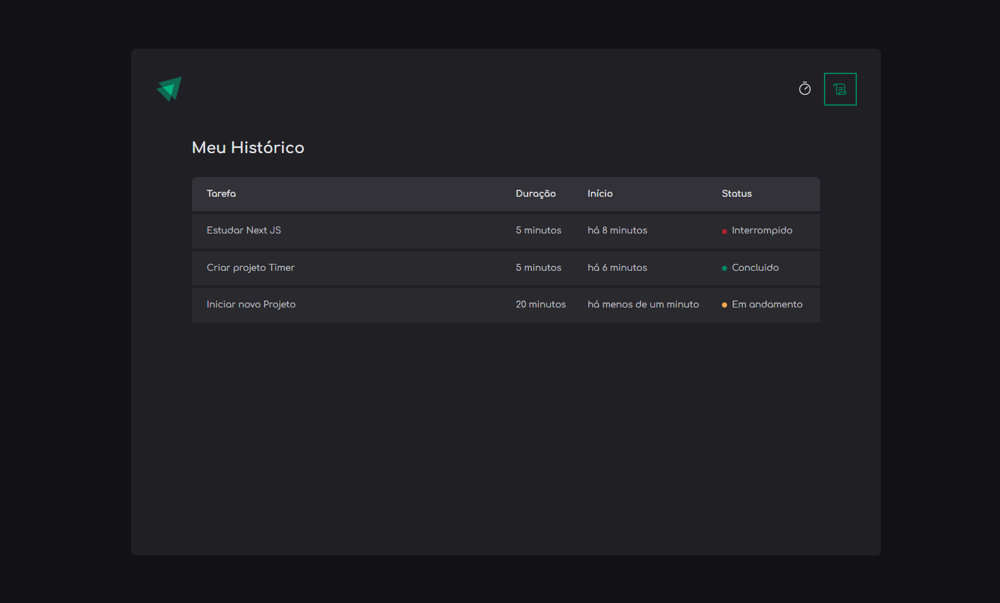
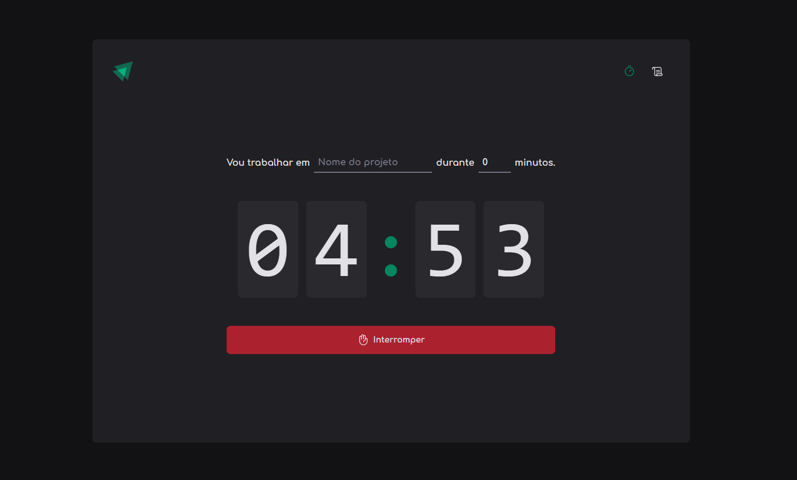

# 🚀 Timer

Projeto criado para estudo. Objetivo do Timer e criar tarefas.

# 🧠 Contexto

Funcionalidades:

- [ ] Adicionar Tarefa
- [ ] Interromper Tarefa

## 📋 Tecnologias

- React.js
- Typescript

## ✏️ Feito por Diogo Travalha
